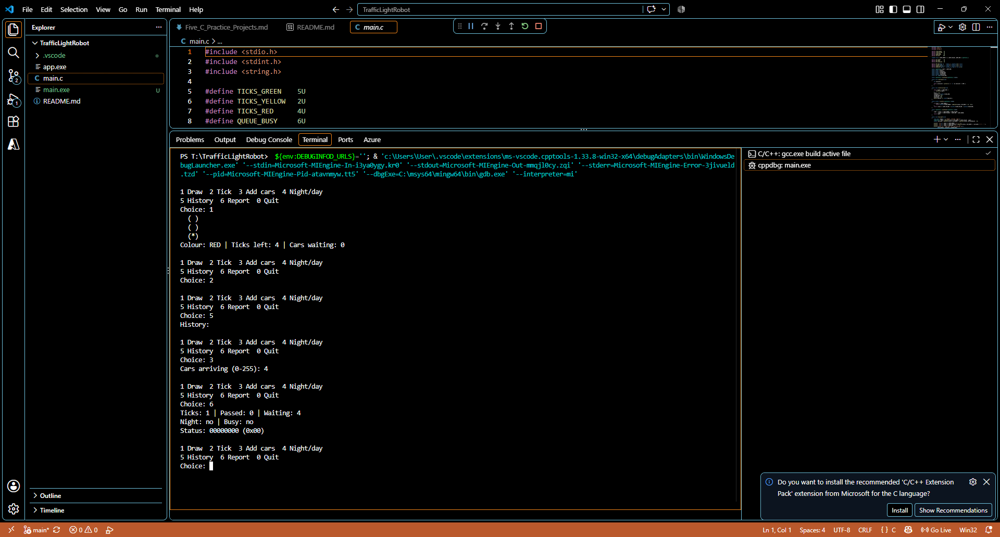

## name : Tasneem Hossam El-Din Hassan Salem
## email : tasneem.hossameldin@outlook.com

# Traffic Light Robot

A plain C99 console simulation for a microcontroller-based traffic light.
The project uses only the standard headers required by the exercise:
`stdio.h`, `stdint.h`, and `string.h`.

## Features

- Cycles through red, green, and yellow states.
- Green lasts 5 ticks, or 7 ticks when more than 6 cars are waiting.
- Yellow lasts 2 ticks.
- Red lasts 4 ticks.
- Allows up to two waiting cars to pass during each green tick.
- Supports night mode with a blinking yellow light.
- Keeps the most recent 20 light-state log entries.
- Reports ticks, cars passed, cars waiting, mode flags, and status bits.
- Rejects invalid input and queue values that exceed the 8-bit queue limit.

## Build

Use any C99 compiler. With GCC:

```text
gcc -std=c99 -Wall -Wextra -o app main.c
```

On Windows, this creates `app.exe`.

## Run

```text
app.exe
```

## Menu

| Choice | Action |
| --- | --- |
| `1` | Draw the current light |
| `2` | Advance the simulation by one tick |
| `3` | Add arriving cars to the queue |
| `4` | Toggle day/night mode |
| `5` | Show the 20-entry light history |
| `6` | Show the crossing report |
| `0` | Exit |

The simulation starts at red with an empty queue and an empty history.

# screenshot:



